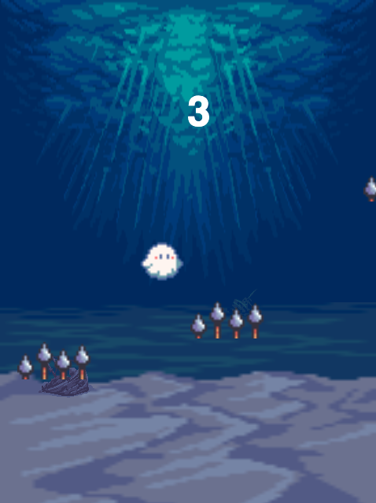

[Flapping Fish](https://vanchen07.github.io/flapping_fish/) is a HTML5 canvas based side scroller game, inspired by Flappy Bird.

## How To Play:

- Click to stay afloat but watch out for the spikes! 

- Each spike you avoid is 1 point. 

- Try to get as many points as you can.

## Technologies
* HTML5 Canvas
* requestAnimationFrame, sprites
* CSS, Javascript

## Roadmap
* Rewards
